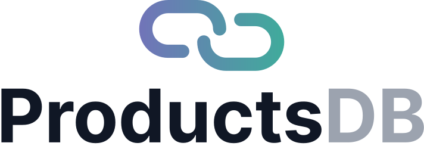

<p align="center">
  <a href="https://products-db.com/" target="blank"></a>
</p>

<p align="center">Seamlessly integrate the power of <strong>ProductsDB</strong> into your Node.js applications with our SDK. Designed for simplicity and efficiency, this SDK provides an intuitive interface for accessing comprehensive product data, enabling developers to fetch, manage, and enrich product information effortlessly. 
</p>

## Features 🌟

- **Easy Integration**: Quick setup with minimal configuration required.
- **Robust Functionality**: Access a wide range of endpoints for real-time product data retrieval and management.
- **Multi-language Support**: Localized data available in 24 languages.
- **Secure Authentication**: Built-in API key authentication for secure data access.

## Getting Started 🛠️

To start using the ProductsDB Node.js SDK, simply install the package and follow our comprehensive documentation for setup and usage examples.

```bash
npm install products-db
```

or, using yarn:

```bash
yarn add products-db
```
